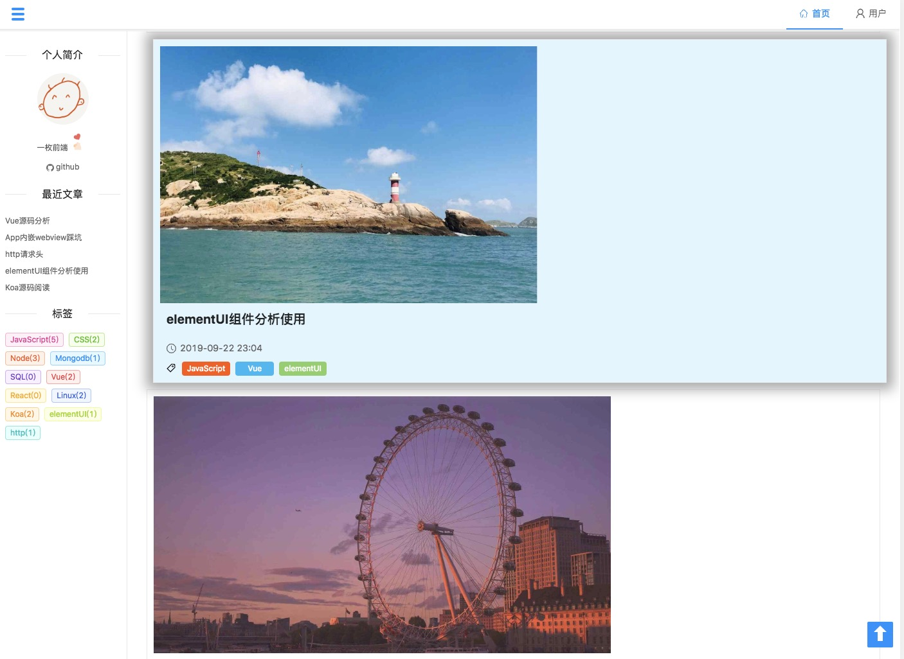
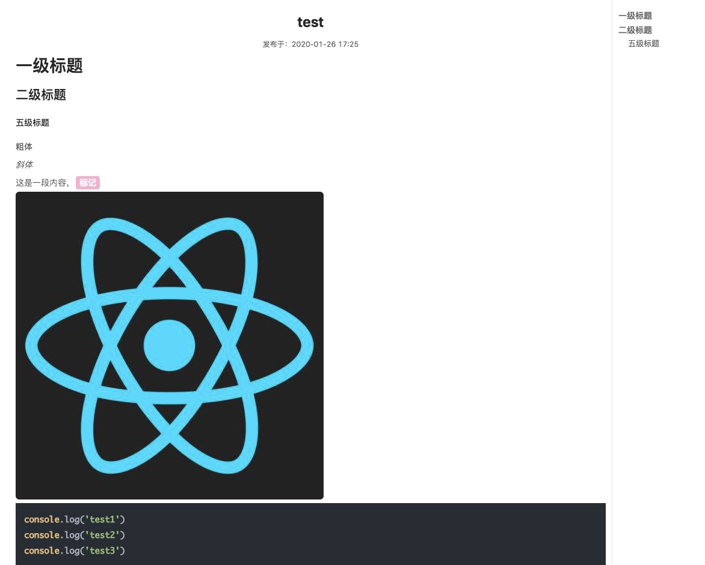
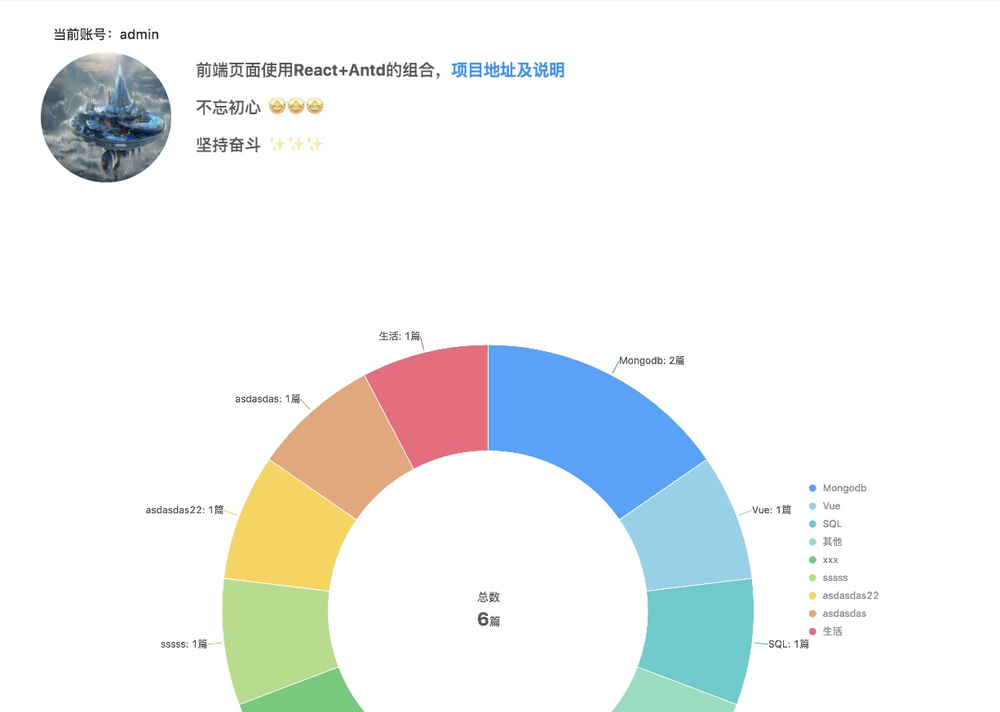

## 前端React+Antd ，后端Koa的博客平台

#### 启动
```js
yarn build:dll //因为用了dllPlugin，先成功公共vendor
yarn start //测试开发
yarn build //生产打包
```

> 为什么不写文档说明，一是写不好，二也是最关键的实在是产出太少了😂

#### 前端作为展示所以结构比较简单
- 主页，查看文章列表

- 文章详情、评论

- 关于，里面包含一些数据统计

##### 前端默认使用的是admin账号的数据

你可以进行[线上预览](http://amz715.com/)

#### 文章如何管理
后台管理的操作有个单独的页面，使用`Vue`+`elementUI`的组合。主要功能如下：

- 文章增删改查
- 评论管理
- 用户管理
- 文章分类标签管理

后台管理打开很慢就不贴出来了，这是[项目地址](https://github.com/tobeapro/vue_back_manage)；

#### 服务端

所有的后台服务也是单独一个项目，使用的是`Koa`，[项目地址](https://github.com/tobeapro/blog-server)。

> 这样加上就有三个地址了，这也是为了方便管理和修改，前端页面两个的原因是首先一个是后台管理一个是展示，其次后台管理页面使用的是`Vue`，所以就分开了。

#### 使用方法
数据库使用的`MongoDB`，没有的话要先安装启动，然后再启动后台服务，运行后台管理页，先注册一个`admin`账号，因为博客展示页默认请求的是admin账号的数据，这时候添加些分类、文章等等；运行博客前端页就可以看到效果了。

> 文章中上传的图片由于保存的是绝对路径，所以在开发环境的前台是看不到的，可以自行配置个代理


